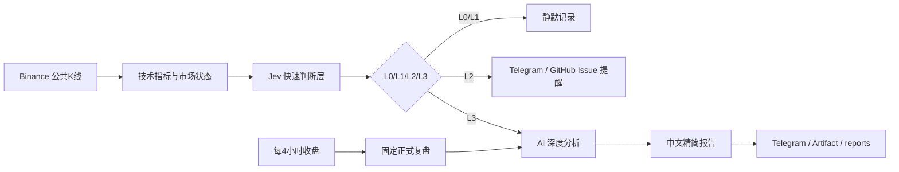

# ₿ BTC Jev Radar

> **一个轻量、可复制的 BTC AI 行情雷达模板。**  
> Binance 提供公开 K 线，Jev 负责快速判断，AI Gateway 负责深度复盘，GitHub Actions 负责自动运行，Telegram / GitHub Issue 负责把真正值得看的变化推到手机。


这个项目不是交易机器人，也不会自动下单。它更像一个 **24 小时值班的行情观察员**：平时安静，行情出现异常时再提醒你；每根 4H K 线收盘后，再自动生成一份简短复盘。

## 为什么做这个项目

很多行情工具的问题不是“数据不够”，而是**提醒太多、噪声太大、每次都让大模型长篇分析成本也高**。

BTC Jev Radar 把任务拆成三层：



核心思路很简单：

> **让便宜、快速的判断层决定“值不值得看”，让大模型只处理真正需要解释的场景。**

## 现在能做什么

- 自动读取 BTCUSDT 的 5m / 15m / 1H / 4H 已收盘 K 线
- 自动计算 EMA20、EMA60、RSI14、MACD、ATR、成交量 Z-Score、20 根 4H 前高前低
- Jev 每次巡检判断：
  - 当前是否属于值得关注的异常
  - 4H 市场结构是否正在发生变化
  - 是否值得立即启动深度分析
- 把事件划分为 L0 / L1 / L2 / L3
- L2 / L3 可推送 Telegram，也可创建 GitHub Issue
- L3 自动触发 AI 深度分析
- 每 4 小时固定生成一份正式复盘
- AI 输出自动清洗为短中文结论，避免输出长篇推理草稿
- 可把运行结果保存为 GitHub Artifact，或选择写回 `reports/`

## 两条自动化工作流

| Workflow | 默认节奏 | 用途 | 推送逻辑 |
|---|---:|---|---|
| **BTC 行情雷达（Jev）** | 每 30 分钟 | 发现异常、结构变化、快速波动 | L2/L3 才提醒 |
| **BTC 4小时正式复盘（GPT）** | 每根 4H K线收盘后 7 分钟 | 固定生成正式复盘 | 每次都可推送 Telegram |

> 为了让这个仓库适合作为公开模板，**定时任务默认不会真正执行**。配置完成后，把 Repository Variable `ENABLE_SCHEDULED_RUNS` 设置为 `true` 即可启用。

## L0～L3 是什么意思

| 等级 | 含义 | 默认处理 |
|---|---|---|
| L0 | 正常波动 | 静默 |
| L1 | 值得留意 | 记录，不打扰 |
| L2 | 明显异常 | Telegram / GitHub Issue 提醒 |
| L3 | 重要结构变化 | 提醒 + AI 深度分析 |

V0.1 默认阈值位于 `src/config.js`。这些阈值是实验参数，不是市场真理，建议先跑一段时间再按自己的交易周期校准。

## 5 分钟快速上手

### 1. 使用这个模板

仓库标记为 Template 后，点击 GitHub 页面右上方的 **Use this template**，创建你自己的仓库。

也可以直接 Fork。

### 2. 准备 AI Gateway Key

项目默认通过 **Vercel AI Gateway** 调用：

- Jev：`typesafe-ai/jev`
- 深度分析模型：默认 `openai/gpt-5.6-sol`
- 备用模型：默认 `inclusionai/ling-3.0-flash-vl-free`

不同账户可访问的模型可能不同。你可以用 GitHub Variables 覆盖模型 ID，而不需要改代码。

在仓库中添加 Secret：

```text
Settings
→ Secrets and variables
→ Actions
→ Secrets
→ New repository secret
```

添加：

```text
AI_GATEWAY_API_KEY
```

### 3. 如果要 Telegram 推送

再添加两个 Secrets：

```text
TELEGRAM_BOT_TOKEN
TELEGRAM_CHAT_ID
```

然后添加 Repository Variable：

```text
ENABLE_TELEGRAM=true
```

详细 Telegram 配置见 [docs/SETUP.md](docs/SETUP.md)。

### 4. 先手动测试

进入：

```text
Actions
→ BTC 行情雷达（Jev）
→ Run workflow
```

再运行：

```text
Actions
→ BTC 4小时正式复盘（GPT）
→ Run workflow
```

手动运行不依赖 `ENABLE_SCHEDULED_RUNS`。

### 5. 打开自动运行

确认两条任务都跑通后，在：

```text
Settings
→ Secrets and variables
→ Actions
→ Variables
```

添加：

```text
ENABLE_SCHEDULED_RUNS=true
```

从此：

- 雷达每 30 分钟巡检一次
- 4H 正式复盘在 UTC 00:07 / 04:07 / 08:07 / 12:07 / 16:07 / 20:07 自动运行

### 6. 按需要打开附加功能

| Variable | 值 | 作用 |
|---|---|---|
| `ENABLE_SCHEDULED_RUNS` | `true` | 开启定时运行 |
| `ENABLE_TELEGRAM` | `true` | 开启 Telegram 推送 |
| `ENABLE_GITHUB_ISSUES` | `true` | L2/L3 自动创建 Issue |
| `SAVE_REPORTS_TO_REPO` | `true` | 把正式报告写回 `reports/` |

这些功能默认关闭，避免新建模板仓库后在尚未配置 Secret 时反复报错。

## 可配置项

以下参数既可以本地写入 `.env`，也可以在 GitHub Actions Variables 中设置：

| 变量 | 默认值 | 说明 |
|---|---|---|
| `BTC_SYMBOL` | `BTCUSDT` | 监控交易对 |
| `BINANCE_BASE_URL` | `https://data-api.binance.vision` | Binance 公共行情地址 |
| `JEV_MODEL` | `typesafe-ai/jev` | Jev 模型 |
| `GPT_MODEL` | `openai/gpt-5.6-sol` | 深度分析首选模型 |
| `GPT_FALLBACK_MODEL_1` | `inclusionai/ling-3.0-flash-vl-free` | 备用模型 |

模型是否可用取决于你自己的 AI Gateway 账户权限与当前服务策略。默认模型不可用时，直接换成自己账户可访问的模型即可。

## 本地运行

需要 Node.js 22+。

```bash
npm install
cp .env.example .env
```

填写 `.env` 后：

```bash
npm run monitor
npm run four-hour
npm run check
```

Telegram 独立测试：

```bash
npm run telegram:test
```

## 输出在哪里

每次运行会生成：

```text
out/
├── decision.json   # 完整结构化状态
├── summary.md      # 中文摘要
└── report.md       # 触发深度分析时生成
```

GitHub Actions 同时会保存 Artifact。

如果开启：

```text
SAVE_REPORTS_TO_REPO=true
```

正式报告还会写入：

```text
reports/YYYY-MM-DD/
reports/latest.md
```

可以查看 [示例报告](docs/EXAMPLE_REPORT.md)。

## 项目结构

```text
.
├── .github/workflows/       # 两条 GitHub Actions 自动化
├── docs/                    # 中文使用文档
├── out/                     # 临时运行结果
├── reports/                 # 可选的历史正式报告
├── src/
│   ├── binance.js           # Binance K线
│   ├── indicators.js        # 技术指标
│   ├── market-state.js      # 市场状态整理
│   ├── jev.js               # Jev 快速判断层
│   ├── gpt.js               # 深度分析与输出清洗
│   ├── report.js            # 报告生成
│   ├── telegram-notify.js   # Telegram 推送
│   └── github-notify.js     # GitHub Issue 推送
├── .env.example
└── package.json
```

更详细的数据流见 [docs/ARCHITECTURE.md](docs/ARCHITECTURE.md)。

## 适合拿来继续实验的方向

这个仓库刻意保持轻量，方便继续改造。例如可以增加：

- Funding Rate / OI / 爆仓数据
- ETH、SOL 或其他交易对
- 多币种统一雷达
- 历史回测 Jev 阈值
- 更细的市场阶段分类
- 假突破风险评分
- 多模型路由
- Bark / Discord / Slack / 企业微信等推送
- 自托管 Runner 或 VPS，提升巡检频率

## 安全说明

**不要把任何真实 API Key、Bot Token、Chat ID 写进代码或 README。**

这个模板只读取公开 Binance 行情，不需要 Binance 账户密钥，也不包含自动交易能力。

公开仓库前建议阅读 [SECURITY.md](SECURITY.md)。

## 风险声明

本项目用于 **行情观察、技术研究和 AI 自动化实验**。

- 不构成投资建议
- 不自动买卖任何资产
- Jev 输出的概率是模型评分，不是客观市场概率
- 技术指标与 AI 判断都可能失效
- 使用第三方模型/API 时请自行关注费用、额度与服务条款

## 文档

- [第一次配置：docs/SETUP.md](docs/SETUP.md)
- [系统架构：docs/ARCHITECTURE.md](docs/ARCHITECTURE.md)
- [示例报告：docs/EXAMPLE_REPORT.md](docs/EXAMPLE_REPORT.md)
- [安全说明：SECURITY.md](SECURITY.md)

## License

MIT License。你可以自由 Fork、修改和用于自己的实验项目。
