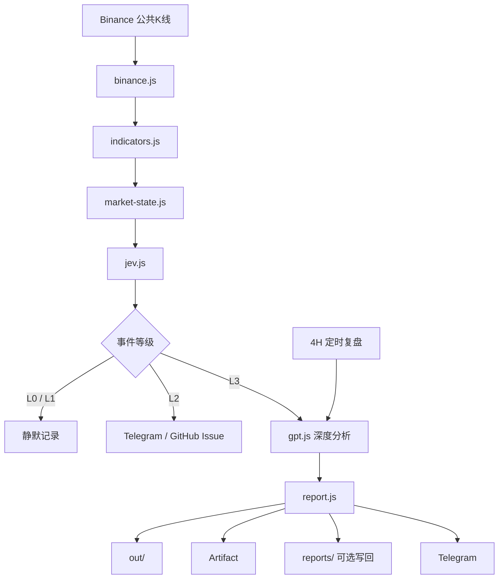

# 系统架构

BTC Jev Radar 的目标不是让一个大模型“包办一切”，而是把行情监控拆成几个职责清晰的模块。



## 1. 行情层

`src/binance.js` 读取 Binance 公共 K 线，不需要交易账户 API Key。

默认同时获取：

- 5 分钟
- 15 分钟
- 1 小时
- 4 小时

只使用已收盘 K 线，避免把尚未完成的 K 线当成最终状态。

## 2. 指标层

`src/indicators.js` 负责计算基础技术指标。

当前包括：

- EMA20 / EMA60
- RSI14
- MACD
- ATR
- 成交量 Z-Score
- 涨跌幅

## 3. 市场状态层

`src/market-state.js` 把原始指标整理成适合 AI 决策的结构化状态。

除了指标，还生成：

- 20 根 4H 前高 / 前低
- 当前价格相对 EMA20 / EMA60 的位置
- 是否突破区间
- 当前市场阶段
- 一组固定规则异常信号

这一步的目的，是避免把几百根原始 K 线直接丢给模型。

## 4. Jev 判断层

`src/jev.js` 不负责长篇分析，只回答三个问题：

1. 当前是否属于值得关注的异常？
2. 4H 市场结构是否正在变化？
3. 是否值得立即启动深度分析？

随后根据概率阈值划分 L0～L3。

这种设计把 Jev 当作“决策路由器”，而不是聊天机器人。

## 5. 深度分析层

`src/gpt.js` 只在两种情况下运行：

- 雷达达到 L3
- 固定 4H 正式复盘

首选模型不可用时可以切备用模型。

为了避免部分模型输出任务解析、英文草稿或推理过程，代码还会对结果进行清洗，并在必要时退化为本地结构化中文摘要。

## 6. 报告层

`src/report.js` 会生成：

```text
out/decision.json
out/summary.md
out/report.md
```

其中：

- `decision.json`：机器可读的完整状态
- `summary.md`：中文基础摘要
- `report.md`：AI 深度分析后的正式报告

## 7. 通知层

### Telegram

`src/telegram-notify.js`

默认策略：

- 雷达 L0/L1：不推送
- 雷达 L2/L3：推送
- 4H 正式复盘：每次都可推送

### GitHub Issue

`src/github-notify.js`

L2/L3 可自动创建 Issue，并带冷却机制防止刷屏。

## 8. 自动化层

`.github/workflows/btc-monitor.yml`

负责每 30 分钟雷达巡检。

`.github/workflows/btc-four-hour.yml`

负责每根 4H K 线收盘后 7 分钟正式复盘。

为了适合作为模板，两条 workflow 默认需要：

```text
ENABLE_SCHEDULED_RUNS=true
```

才会执行定时任务。

## 9. 为什么不直接让大模型每 5 分钟分析一次？

因为那会带来三个问题：

- 成本更高
- 噪声更多
- 很难区分“普通波动”和“值得处理的事件”

这个项目的设计重点不是“模型越多越好”，而是：

> 先把数据整理成状态，再让轻量判断层决定是否升级处理。

## 10. 最适合继续扩展的位置

如果你要把它做成自己的版本，优先扩展下面三层：

### 数据层

加入：

- Funding Rate
- Open Interest
- 爆仓
- 现货 / 合约价差
- ETF / 宏观数据

### 决策层

增加 Jev 问题，例如：

- 假突破风险
- 趋势衰减风险
- 是否进入高波动状态
- 是否需要提高巡检频率

### 通知层

增加：

- Bark
- Discord
- Slack
- 企业微信
- 邮件

核心框架不需要因此推倒重来。
